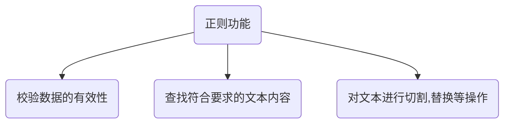
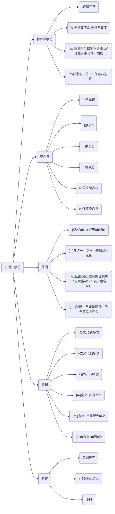
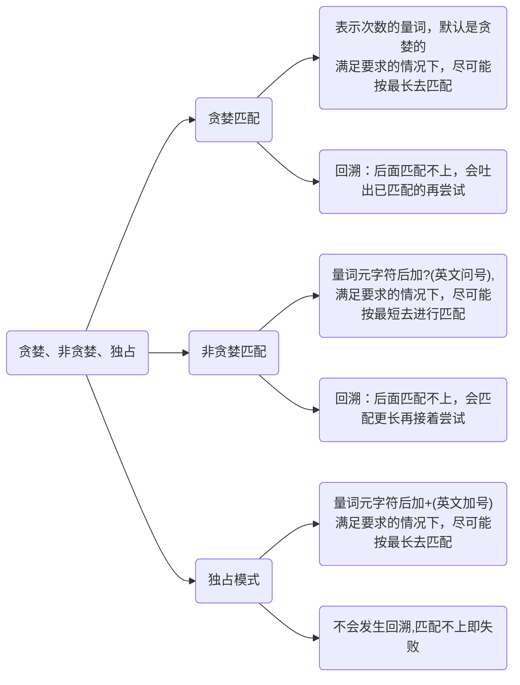
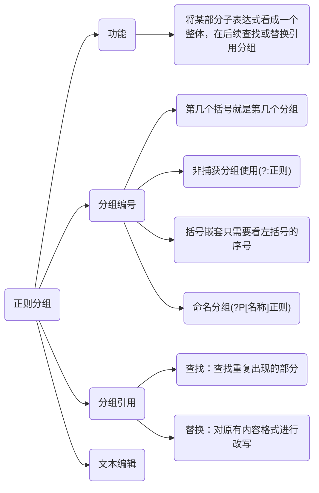
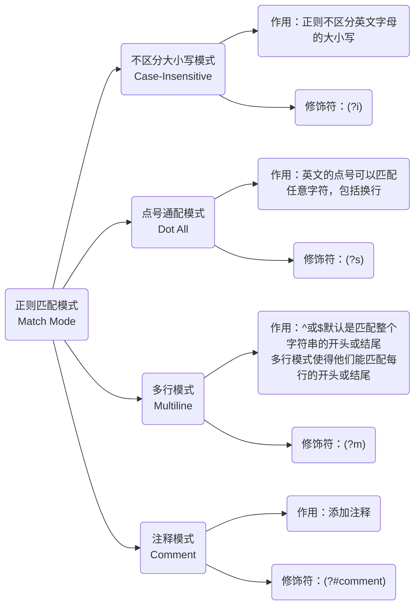
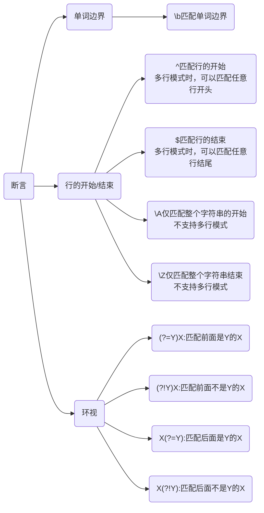

如果你有一个问题，你想到可以用正则来解决，那么你有两个问题了。

Some people, when confronted with a problem, think "I know,i'll use regular expressions." Now they have two problems

<!--more-->

### 写正则过程

1. 先分解

   这个问题可以分成几个子问题，是否可以用多个正则来完成(密码强度校验，一个校验大小写，一个校验数字标点，一个校验强度)

2. 解决子问题

   某个位置上可能有多个字符？那就用字符组。某个位置上可能有多个字符串？那就用多选结构。出现的次数不确定？那就用量词。对出现的位置有要求？那就用锚点锁定位置

3. 套皮

   也就是把如何解决子问题转化为正则表达式

4. 调试

   复杂⼀点的正则表达式不能⼀次写对，这是很正常的

测试网页：https://regex101.com/

### 正则功能





### 正则元字符




示例：

1. 匹配某个网络资源：以 http:// 或者https:// 或者ftp://开头
2. 第一位固定为1，第二位可能是3-9，第三位到第11位可以是任意数字


### 量词与贪婪

举例：
有字符串"aaabb"，有正则表达式"a+"，问有多少个匹配结果
有字符串"aaabb"，有正则表达式"a*"，问有多少个匹配结果

#### 贪婪匹配(Greedy)

有字符串"aaabb"，有正则表达式"a*"，问有多少个匹配结果 的匹配过程

| 匹配   | 开始 | 结束 | 说明                                         | 匹配内容 |
| ------ | ---- | ---- | -------------------------------------------- | -------- |
| 第一次 | 0    | 3    | 到第一个字母b发现不满足，输出aaa             | aaa      |
| 第二次 | 3    | 3    | 匹配剩下的bb，发现匹配不上，输出空字符串     | 空字符串 |
| 第三次 | 4    | 4    | 匹配剩下的b，发现匹配不上，输出空字符串      | 空字符串 |
| 第四次 | 5    | 5    | 匹配剩下空字符串，发现匹配不上，输出空字符串 | 空字符串 |

#### 非贪婪模式(Lazy)

有字符串"aaabb"，有正则表达式"a*?"，问有多少个匹配结果
9个结果

在python2.7中只能匹配到空串，在java8中只能匹配到空串，  在python3.7.7中可以匹配

```python
>>> re.findall(r"a*?","aaabb")
['', 'a', '', 'a', '', 'a', '', '', '']
```

```python
>>> re.findall(r"a*?","aaabb")
['', '', '', '', '', '']
```


示例：查找双引号之间的单词

字符串如下 "the little cat" is a toy,it looks "a little bad"

贪婪：".*"

非贪婪:".*?"

#### 独占模式

一般不怎么用


示例：

we found “the little cat” is in the hat, we like “the little cat”

其中双引号中的单词看成一个单词，即the little cat 是一个单词


#### 总结





### 分组与引用


匹配身份证号：15位或18位数字

#### 分组与编号

括号在正则中可以用于分组，被括号括起来的部分“子表达式”会被保存成一个子组。第几个括号就是第几个分组	

#### 不保存子组

可以在括号里面使用 ?: 不保存子组。

#### 括号嵌套

我们只需要数左括号（开括号）是第几个，就可以确定是第几个子组

假设时间格式是 2020-05-10 20:23:05 。

((\d{4})-(\d{2})-(\d{2})) ((\d{2}):(\d{2}):(\d{2}))

日期分组编号是 1，时间分组编号是 5，年月日对应的分组编号分别是 2，3，4，时分秒的分组编号分别是 6，7，8。

#### 命名分组

由于编号得数在第几个位置，后续如果发现正则有问题，改动了括号的个数，还可能导致编号发生变化，因此一些编程语言提供了命名分组（named grouping），这样和数字相比更容易辨识，不容易出错。命名分组的格式为(`?P<分组名>正则`)。

#### 分组引用

在知道了分组引用的编号 （number）后，大部分情况下，我们就可以使用 “反斜扛 + 编号”，即 \number 的方式来进行引用

#### 分组引用在查找中使用

前面出现的单词再次出现：(\w+)\1

https://regex101.com/r/Adg1Og/4

#### 分组引用在替换中使用

我们可以使用反向引用，在得到的结果中，去拼出来我们想要的结果

https://regex101.com/r/Adg1Og/5




### 匹配模式


#### 不区分大小写模式（Case-Insensitive）

示例：如要查找单词 cat，我们并不需要关心单词是 CAT、Cat，还是 cat

reg = `[Cc][Aa][Tt]`

当我们把模式修饰符放在整个正则前面时，就表示整个正则表达式都是不区分大小写的。模式修饰符是通过 (? 模式标识) 的方式来表示的。  我们只需要把模式修饰符放在对应的正则前，就可以使用指定的模式了。

由于不分大小写的英文是 Case-Insensitive，那么对应的模式标识就是 I 的小写字母 i，所以不区分大小写的 cat 就可以写成 (?i)cat。

text=`cat\n CAT\nCat`

我们也可以用它来尝试匹配两个连续出现的 cat，如下图所示，你会发现，即便是第一个 cat 和第二个 cat 大小写不一致，也可以匹配上。

https://regex101.com/r/x1lg4P/1

如果我们想要前面匹配上的结果，和第二次重复时的大小写一致，那该怎么做呢？我们只需要用括号把**修饰符和正则 cat **部分括起来，加括号相当于作用范围的限定，让不区分大小写只作用于这个括号里的内容

https://regex101.com/r/x1lg4P/2

需要注意的是，这里正则写成了 ((?i)cat) \1，而不是 ((?i)(cat)) \1。也就是说，我们给修饰符和 cat 整体加了个括号，而原来 cat 部分的括号去掉了。如果 cat 保留原来的括号，即 ((?i)(cat)) \1，这样正则中就会有两个子组，虽然结果也是对的，但这其实没必要

如果用正则匹配，实现部分区分大小写，另一部分不区分大小写，这该如何操作呢？就比如说我现在想要，the cat 中的 the 不区分大小写，cat 区分大小写

也就是 ((?i)the) cat

https://regex101.com/r/x1lg4P/3


#### 单行模式

单行的英文表示是 Single Line，单行模式对应的修饰符是 (?s)

https://regex101.com/r/Adg1Og/1

#### 多行匹配模式（Multiline）

通常情况下，^匹配整个字符串的开头，$ 匹配整个字符串的结尾。多行匹配模式改变的就是 ^ 和 $ 的匹配行为

https://regex101.com/r/Adg1Og/2

多行模式的作用在于，使 ^ 和 $ 能匹配上每行的开头或结尾，我们可以使用模式修饰符号 (?m) 来指定这个模式。

https://regex101.com/r/Adg1Og/3

#### 注释模式（Comment）

正则中注释模式是使用 (?#comment) 来表示。



问题：

提取html中head标签中的所有内容


### 断言

简单来说，断言是指对匹配到的文本位置有要求。比如，去查找一个单词，我们要查找 tom，但其它的单词，比如 tomorrow 中也包含了 tom。


#### 单词边界（Word Boundary）

我们想要把下面文本中的 tom 替换成 jerry。注意一下，在文本中出现了 tomorrow 这个单词，tomorrow 也是以 tom 开头的。

> tom asked me if I would go fishing with him tomorrow.

利用前面学到的知识，我们如果直接替换，会出现下面这种结果。

```tex
替换前：tom asked me if I would go fishing with him tomorrow.
替换后：jerry asked me if I would go fishing with him jerryorrow.
```

单词的组成一般可以用元字符 \w+ 来表示，\w 包括了大小写字母、下划线和数字（即 [A-Za-z0-9_]）。那如果我们能找出单词的边界，也就是当出现了\w 表示的范围以外的字符，比如引号、空格、标点、换行等这些符号，我们就可以在正则中使用\b 来表示单词的边界。 \b 中的 b 可以理解为是边界（Boundary）这个单词的首字母。

|          | tom  | \btom | tom\b | \btom\b |
| -------- | ---- | ----- | ----- | ------- |
| tom      | √    | √     | √     | √       |
| tomorrow | √    | √     | ×     | ×       |
| atom     | √    | ×     | √     | ×       |
| atomic   | √    | ×     | ×     | ×       |


#### 行的开始或结束

可以参考**空白符**和**匹配模式**

#### 环视（ Look Around）

比如我们要提取六位数字的邮政编码，不能简单的写`\d{6}`，这样的话，11位数字的手机号码也能匹配，也就是说，除了文本本身组成符合这 6 位数的规则外，这 6 位数左边或右边都不能是数字。正则是通过环视来解决这个问题的

| 正则   | 名称                                | 含义      | 示例                                     |
| ------ | ----------------------------------- | --------- | ---------------------------------------- |
| `(?<=Y)` | 肯定逆序环视<br>positive-lookbehind | 左边是Y   | `(?<=\d)th`:左边是数字的th，能匹配9th      |
| `(?<!Y)` | 否定逆序环视<br>negative-lookbehind | 左边不是Y | `(?<!\d)th`:左边不是数字的th，能匹配health |
| `(?=Y)`  | 肯定顺序环视<br>positive-lookhead   | 右边是Y   | `six(?=\d)`:右边是数字的siz，能匹配six6    |
| `(?!Y)`  | 否定逆序环视<br>negative-lookhead   | 右边不是Y | `hi(?!\d)`:右边不是数字的hi，能匹配high    |


#### 环视与子组

环视中虽然也有括号，但不会保存成子组。保存成子组的一般是匹配到的文本内容，后续用于替换等操作，而环视是表示对文本左右环境的要求，即环视只匹配位置，不匹配文本内容




---

以上